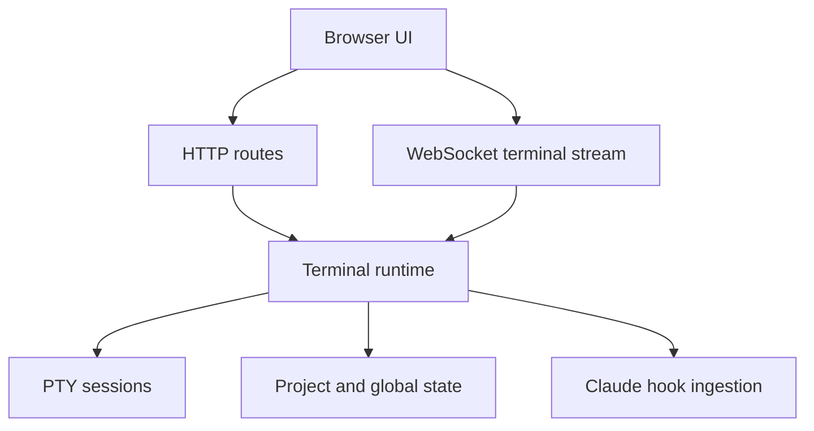

# Runtime And API

Octogent runs as a local API with a local web UI on top.

## Runtime shape

## What the API does

- starts and restores terminal metadata
- serves the web UI when bundled assets are available
- manages PTY-backed terminal sessions
- creates worktrees for isolated terminals
- persists UI state and conversation state
- reads tentacle files and todo progress
- accepts hook events from Claude Code
- exposes channels for inter-agent messages

## Transport model

- HTTP for CRUD, metadata, and snapshots
- WebSocket for live terminal IO
- file-backed state for persistence

## Security defaults

- binds to `127.0.0.1` by default
- enforces loopback `Host` and `Origin` checks by default
- remote access must be enabled explicitly with `OCTOGENT_ALLOW_REMOTE_ACCESS=1`

## Persistence model

- project-local scaffold lives under `.octogent/`
- runtime state lives under `~/.octogent/projects/<project-id>/state/`
- transcript events persist independently from PTY scrollback
- PTY sessions do not survive API restarts
- terminal records persisted as `running` are reconciled to `stale` on startup when no live Octogent session owns them

## Main API groups

- terminals and snapshots
- deck tentacles and todo operations
- prompts
- channels
- code intel
- hook ingestion
- usage and telemetry
- monitor
- conversations

For the exact endpoints, see [API reference](../reference/api.md).
